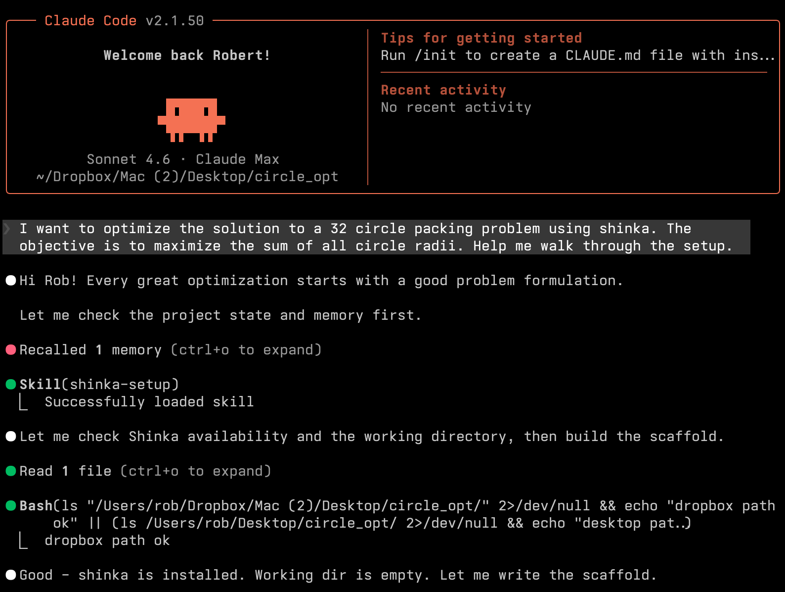
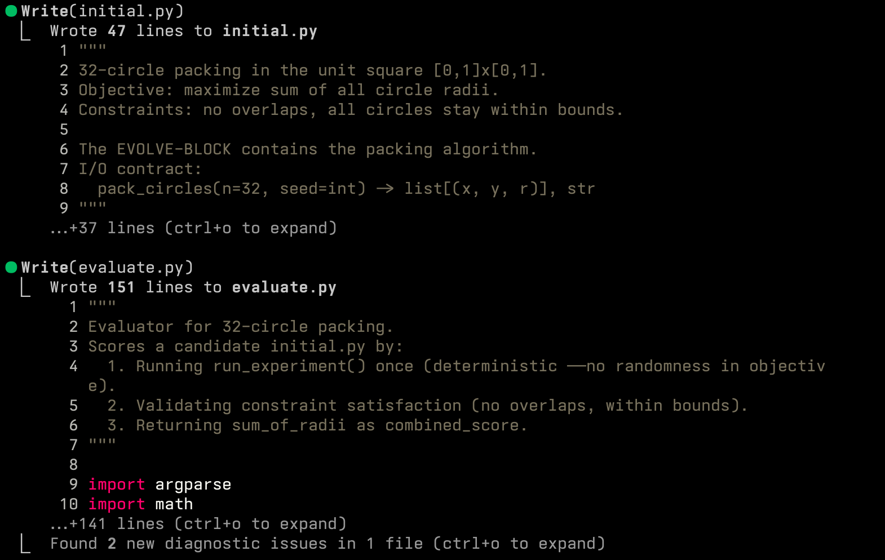
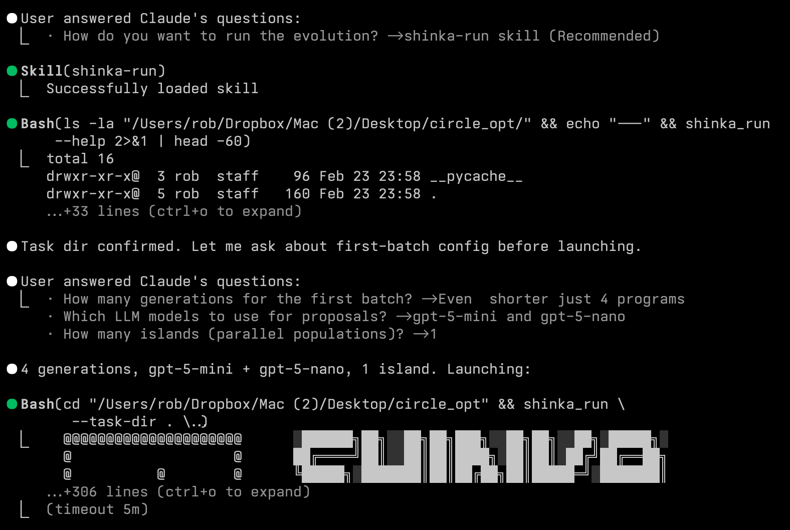
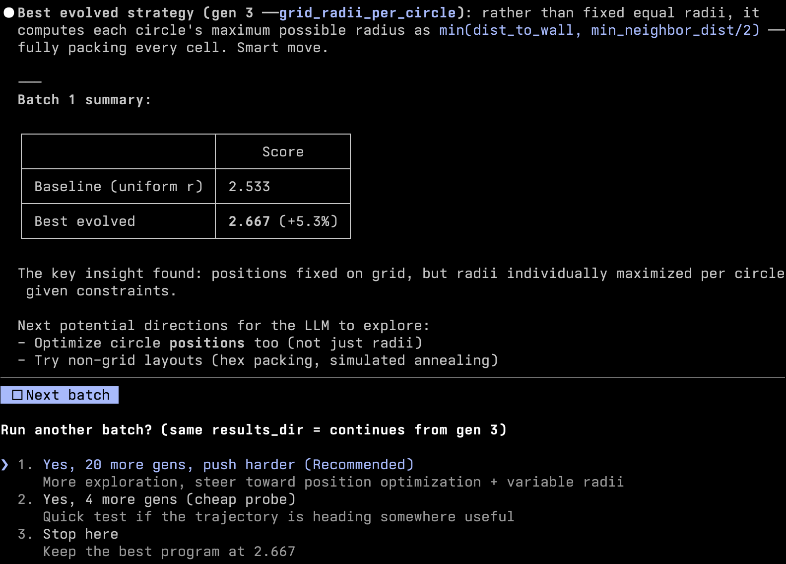

# Agentic Usage Guide

This guide shows how to run Shinka with coding agents using the project skills:

- `shinka-setup`: scaffold task files (`evaluate.py`, `initial.<ext>`, optional run config)
- `shinka-run`: launch and iterate evolution batches via `shinka_run`

It covers:
- installing Shinka
- installing Claude Code and/or Codex CLI
- copying skill files to the right skill directories
- running a practical setup -> run loop

## 1) Install Shinka

From a clean machine:

```bash
git clone https://github.com/SakanaAI/ShinkaEvolve.git
cd ShinkaEvolve

uv venv --python 3.11
source .venv/bin/activate
uv pip install -e .
```

Set API keys (example):

```bash
cp .env.example .env 2>/dev/null || true
# Edit .env and add OPENAI_API_KEY / ANTHROPIC_API_KEY as needed
```

## 2) Install Agent CLI(s)

Install one or both.

### Claude Code

```bash
npm install -g @anthropic-ai/claude-code
claude --version
```

### Codex CLI

```bash
npm install -g @openai/codex
codex --version
```

## 3) Copy Skills to Agent Skill Folders

Skill source files in this repo:

- `skills/shinka-setup/SKILL.md`
- `skills/shinka-run/SKILL.md`
- optional helper scripts for setup skill:
  - `skills/shinka-setup/scripts/run_evo.py`
  - `skills/shinka-setup/scripts/shinka.yaml`

### Claude Code skill path

```bash
mkdir -p ~/.claude/skills/shinka-setup ~/.claude/skills/shinka-run
cp skills/shinka-setup/SKILL.md ~/.claude/skills/shinka-setup/SKILL.md
cp -R skills/shinka-setup/scripts ~/.claude/skills/shinka-setup/
cp skills/shinka-run/SKILL.md ~/.claude/skills/shinka-run/SKILL.md
```

### Codex skill path

```bash
mkdir -p ~/.codex/skills/shinka-setup ~/.codex/skills/shinka-run
cp skills/shinka-setup/SKILL.md ~/.codex/skills/shinka-setup/SKILL.md
cp -R skills/shinka-setup/scripts ~/.codex/skills/shinka-setup/
cp skills/shinka-run/SKILL.md ~/.codex/skills/shinka-run/SKILL.md
```

## 4) Setup Skill Walkthrough (`shinka-setup`)

Ask the agent to scaffold a new task directory and evaluator contract.

Example prompt:

```text
Use shinka-setup to scaffold a new task in examples/my_task.
Language: python.
Goal: maximize <metric>.
```

Illustration (setup flow):





Expected output:
- `initial.<ext>` with evolve block
- `evaluate.py` producing `metrics.json` + `correct.json`
- optional `run_evo.py` / `shinka.yaml` scaffolds when requested

## 5) Run Skill Walkthrough (`shinka-run`)

Use `shinka_run` for agent-driven evolution loops.

Minimal batch:

```bash
shinka_run \
  --task-dir examples/my_task \
  --results_dir results/my_task_agent \
  --num_generations 10
```

With core knobs via `--set`:

```bash
shinka_run \
  --task-dir examples/my_task \
  --results_dir results/my_task_agent \
  --num_generations 20 \
  --set evo.max_api_costs=0.5 \
  --set evo.llm_models='["gpt-5-mini","gpt-5-nano"]' \
  --set db.num_islands=3 \
  --set db.parent_selection_strategy=weighted
```

Illustration (run flow):





## 6) Batch Iteration Rules (Important)

When using `shinka-run` skill:

- unless user explicitly requests fully autonomous execution, ask for config confirmation between batches
- keep `--results_dir` the same across continuation batches so prior state can reload
- change `--results_dir` only when intentionally forking a new run

## 7) Quick Validation Checklist

Before first run:

- `shinka_run --help` works
- task dir has `evaluate.py` + `initial.<ext>`
- API keys are available in environment
- skill files are installed under `~/.claude/skills` and/or `~/.codex/skills`

After each batch:

- check run artifacts/logs under the chosen `results_dir`
- review score and correctness trend
- choose next batch config (budget, models, islands, attempts, generations)

